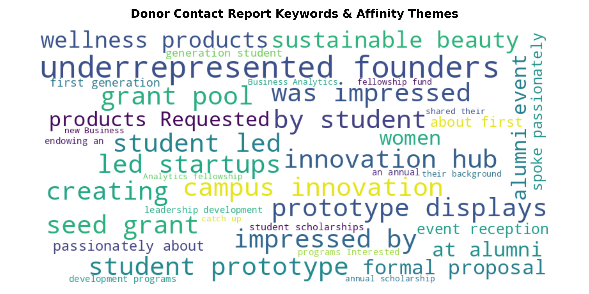

# Donor Contact Report Mining & Affinity Tagging Pipeline
NLP-driven extraction of donor interest tags, giving affinity, and engagement sentiment from unstructured Advancement contact reports for CRM enrichment.
# Advancement Contact Report Mining & Donor Tagging Pipeline

## Overview
This project applies Natural Language Processing (NLP) and text mining to unstructured Fundraisers contact reports. It automatically extracts donor interest tags, 
categorizes engagement sentiment, and outputs structured data ready for CRM insertion (e.g., Salesforce Education Cloud, Blackbaud NXT) to drive personalized annual giving campaigns. This Natural Language Processing (NLP) pipeline analyzes unstructured Fundraiser contact reports to extract structured constituent affinity tags and evaluate donor engagement sentiment. By transforming narrative meeting notes into actionable data, this tool automates CRM enrichment (Salesforce Education Cloud / Blackbaud NXT) to drive hyper-personalized higher education fundraising campaigns.

## Target Impact
- **Automated CRM Enrichment:** Eliminates manual tagging by extracting core interests directly from meeting notes.
- **Hyper-Personalized Outreach:** Enables targeted email segmentation based on specific donor passions (e.g., student incubators, equity funds, specific academic colleges).
- **Pipeline Risk Detection:** Flags negative or neutral sentiment notes for immediate manager review.

## Portfolio Visualization

## Tech Stack
- **Python:** `pandas`, `nltk`, `wordcloud`, `matplotlib`
- **NLP Techniques:** Tokenization, Stop-word Removal, TF-IDF Keyphrase Extraction, VADER Sentiment Analysis
