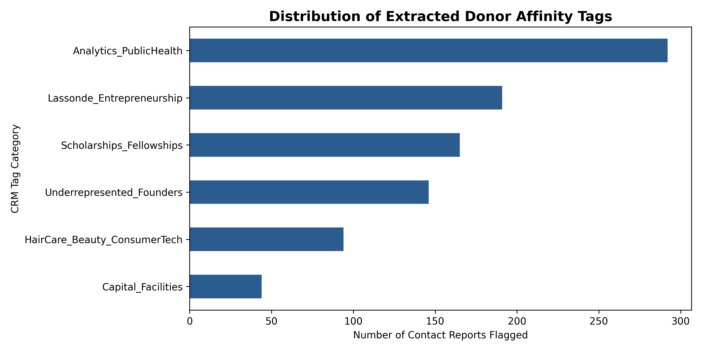
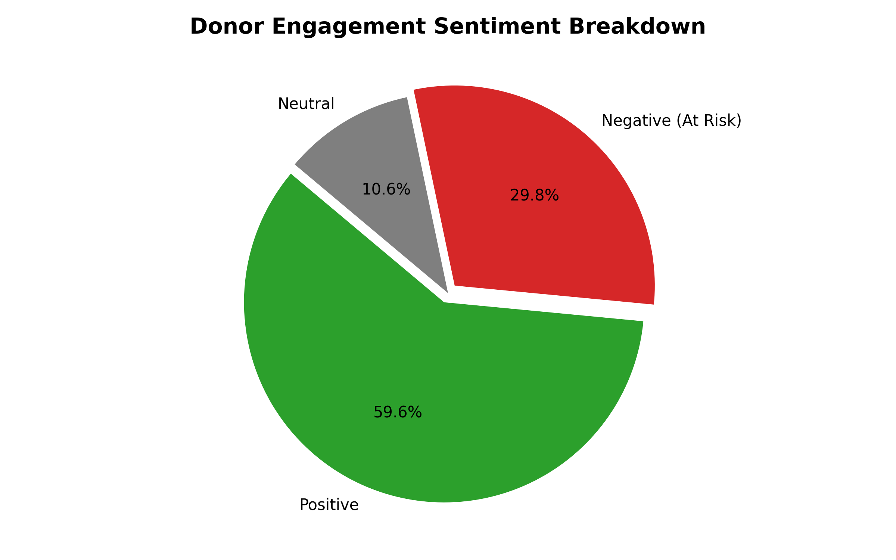

# Donor Contact Report Mining & Affinity Tagging Pipeline
### Advancement Contact Report Mining & Donor Tagging Pipeline
NLP-driven extraction of donor interest tags, giving affinity, and engagement sentiment from unstructured Advancement contact reports for CRM enrichment.

## Overview
This project applies Natural Language Processing (NLP) and text mining to unstructured Fundraisers contact reports. It automatically extracts donor interest tags, 
categorizes engagement sentiment, and outputs structured data ready for CRM insertion (e.g., Salesforce Education Cloud, Blackbaud NXT) to drive personalized annual giving campaigns. This Natural Language Processing (NLP) pipeline analyzes unstructured Fundraiser contact reports to extract structured constituent affinity tags and evaluate donor engagement sentiment. By transforming narrative meeting notes into actionable data, this tool automates CRM enrichment (Salesforce Education Cloud / Blackbaud NXT) to drive hyper-personalized higher education fundraising campaigns.

## Target Impact
- **Automated CRM Enrichment:** Eliminates manual tagging by extracting core interests directly from meeting notes.
- **Hyper-Personalized Outreach:** Enables targeted email segmentation based on specific donor passions (e.g., student incubators, equity funds, specific academic colleges).
- **Pipeline Risk Detection:** Flags negative or neutral sentiment notes for immediate manager review.

## Visualization & Dashboard Outputs
### 1. Key Keyword & Affinity Word Cloud
Highlights high-frequency donor interests and themes extracted across all contact notes.


### 2. CRM Tag Distribution
Shows the frequency of extracted interest categories across the constituent pipeline.


### 3. Engagement Sentiment & Pipeline Risk Breakdown
Categorizes overall donor sentiment to isolate positive leads and identify at-risk major donors needing executive intervention.


## Key Features
- **Automated CRM Tag Extraction:** Uses multi-keyword regex matching to categorize notes into actionable CRM interest tags (`Lassonde_Entrepreneurship`, `Underrepresented_Founders`, `HairCare_Beauty_ConsumerTech`, `Analytics_PublicHealth`, `Scholarships_Fellowships`, `Capital_Facilities`).
- **Lexicon Sentiment & Risk Scoring:** Calculates a normalized sentiment score ($-1.0$ to $+1.0$) to categorize notes as `Positive`, `Neutral`, or `Negative (At Risk)`.
- **Scalable Multi-Year Dataset:** Tested on 500 multi-year contact reports representing 100 unique constituents and 5 gift officers spanning October 2024 to September 2026.
- **Data Export Ready:** Generates an enriched CSV (`contact_reports_enriched.csv`) pre-formatted for direct CRM ingestion or Tableau/Power BI dashboarding.
- 
## Tech Stack
- **Language:** Python 3.x
- **Data Manipulation:** `pandas`, `numpy`
- **Text Processing & Regular Expressions:** `re`
- **Data Visualization:** `nltk`,`wordcloud`, `matplotlib`
- **NLP Techniques:** Tokenization, Stop-word Removal, TF-IDF Keyphrase Extraction, VADER Sentiment Analysis

---

## Repository Structure

```text
donor-contact-report-nlp/
│
├── generate_data.py             # Script 1: Synthetic 500-report data generator
├── process_nlp_reports.py       # Script 2: NLP tag extraction, sentiment engine, & viz
├── contact_reports.csv          # Raw synthetic contact report dataset (500 rows)
├── contact_reports_enriched.csv # Processed dataset with extracted tags & sentiment
├── donor_wordcloud.png          # Visual 1: Word Cloud image
├── crm_tag_distribution.png     # Visual 2: Tag frequency bar chart
├── sentiment_breakdown.png      # Visual 3: Sentiment pie chart
└── README.md                    # Project documentation
